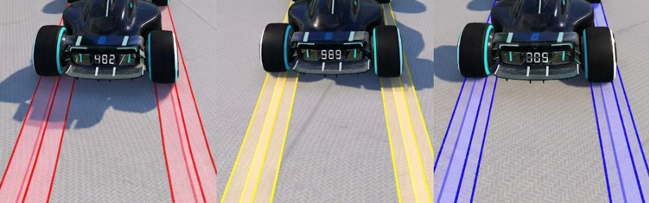

# SD-Trainer-Plugin

Openplanet plugin for Trackmania that swaps skidmark textures in real time based on speed drift quality.

## Download

- Get the latest build from the Releases page: <https://github.com/TNTisdial/sd-trainer-plugin/releases/latest>

## Status and compatibility

- This plugin is still a work in progress and needs more tuning/cleanup before Openplanet submission for School use.
- You must set Openplanet Signature Mode to `Developer` for this plugin to run.
- This plugin conflicts with `XertroV/tm-modless-skids` because both touch skid files in `ModWork`.
- If you leave Developer mode and want your previous skids back, open Modless-Skids settings in Openplanet, from the Trackmania main menu, click Open Modwork Folder, then delete `ModWork` entirely (not just the contents). Your previous skids/preferences should restore after loading a map.

## Install

- Copy `SD-Trainer-Plugin.op` to `C:\Users\<username>\OpenplanetNext\Plugins`.
- Launch Trackmania with Openplanet, change Signature Mode to `Developer`
- In Openplanet click the developer tab, hover over `Load Plugin` 
- Click SD-Trainer-Plugin

## What it does

- Computes drift quality (`driftQualityRatio`) each frame from measured acceleration vs surface-specific expected max acceleration.
- Maps quality to tiers: `default`, `poor`, `mid`, `high`.
- Swaps skid textures across asphalt, dirt, and grass.
- Includes a skin-picker UI for selecting tier textures per surface.

## Documentation

- `docs/io-system.md` for staging and swap pipeline details.
- `docs/acceleration-logic.md` for drift-quality computation.
- `docs/settings-reference.md` for runtime settings and defaults.
- `docs/skid-picker-ui.md` for UI behavior and hidden persisted fields.

## Authors

This project was primarily written using OpenCode with GPT-5.3-Codex, Claude Opus 4.6, and Gemini 3.1, with final decisions and validation by the maintainer.

Thanks to the people and projects that made this possible:

- XertroV (`XertroV/tm-modless-skids`) for core modless skid swap reference patterns.
- voblivion (`voblivion/Openplanet-IMG`) for DDS preview helper code used in `DDS_IMG/`.
- Magpie (`SilasDo/Trackmania-Speed-Drift-Trainer-Plugin`) for speed-drift acceleration logic direction.
- Shorty for proving the concept.
